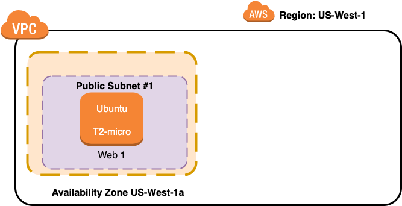

# Creating a New VPC

## With One Public Subnet and One Web Server

The Web server starts out as a simple "Hello World"



------

## Requirements 

[Install AWS CLI](https://docs.aws.amazon.com/cli/latest/userguide/cli-chap-install.html)

[Configure AWS CLI](https://docs.aws.amazon.com/cli/latest/userguide/cli-chap-configure.html)

[Install Terraform](https://learn.hashicorp.com/tutorials/terraform/install-cli)

```
Note:  You don't have to install these requirements into your desktop.  You can use virtual desktops instead or cloud based desktops.  For example running a Linux platform like Ubuntu using Oracle's Virtualbox then install the requirements within that development environment.  Or perhaps use AWS Cloud 9 environment.
```

## Configuration

`Note: The variables do not have to be changed if you are ok with running a new VPC and Web server out of US-West-1 region`

Once the requirements are installed clone this repository and edit the file variables.tf

*  Edit the variable for your choice for AWS Region (currently, the default is "us-west-1").
*  Edit the CIDR blocks if you want to use different address range for your new VPC
*  Edit the Instance type if you want to use a different instance type (note t2.micro is the only one you can use for free tier)
*  Note: I'm including a "jenkins file", to run all builds through Jenkins, but you do not need to use Jenkins for this repository to work.  You can clone this repository and run "Terraform Init" and "Terraform Apply"  with or without the Jenkins file.  

## Launching the VPC and Web Server
After installing the requesite software and configuration of variables.

Run the following commands in terminal

* Terraform init (Causes terraform to install the necessary provider modules, in this case to support AWS provisioning)
* terraform validate (Validates the AWS provisioning code)
* Terraform Apply (Performs the AWS provisioning of VPC and Web Server)

After Terraform finishes provisioning the new VPC, Security Group and Web Server, it will output the Public IP address of the new public server in the terminal Window

------

#### Open a browser and you should see the welcome to nginx as shown below:


------

## Clean up

Once you have finished with this example run:

* **RUN Terraform Destroy (to remove VPC and Web Server)**


* If using the Jenkinsfile, it is required to use and configure Terraform Plugin in Jenkins.  
* I have a built in name for a Jenkins Slave encoded in the Jenkins file, pay attention to the Agent name.  
* If you do run it in Jenkins, the Jenkinsfile uses paramaters, allowing you to run the project to build in AWS the first time.  
** To remove from AWS after Jenkins build, goto Jenkins project, manually "Build with Parameters" and choose Destroy" **

* Note: The terraform plugin doesn't recognize parameters the first time it is run, (a bug in Jenkins),hence will fail because it doesn't see the parameters on the first run.  I am Ok with that, for myself, however to make it run the first time, everytime, you might want to remove the lines associated with using workspace naming paramater and the line that utilizes the workspace name.

*Also, if using the Jenkins file, pay attention to the credential names to plug in your secret credentials for AWS within Jenkins, or better yet use base64encode to encrypt the credentials.
